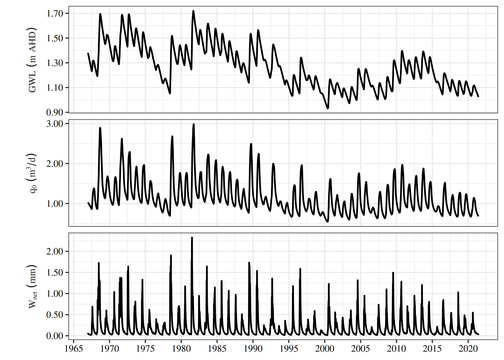
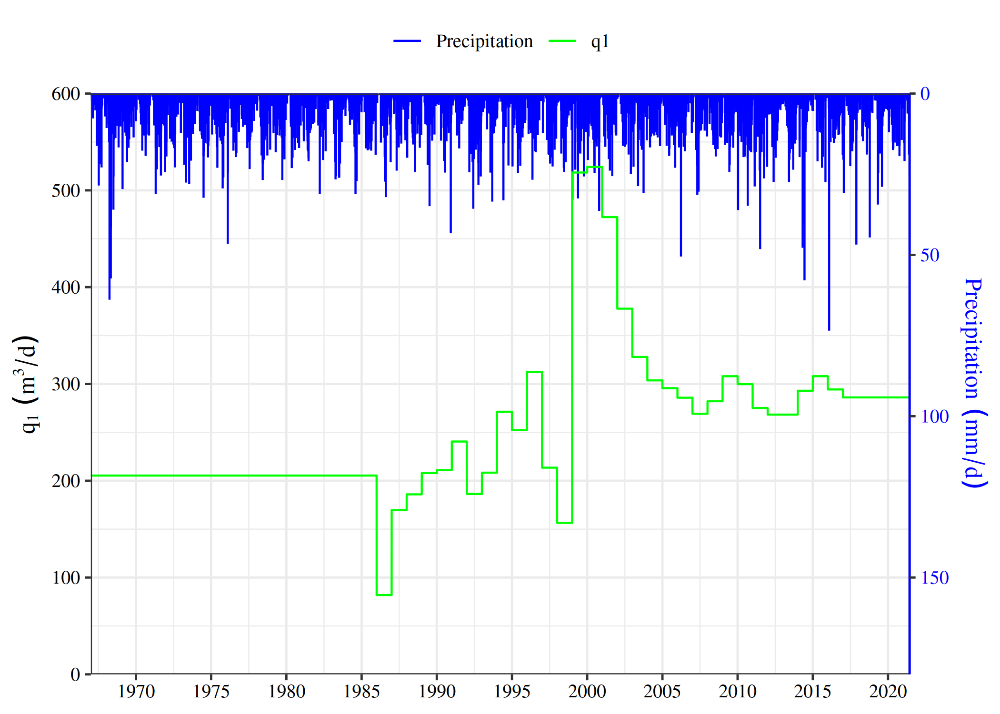
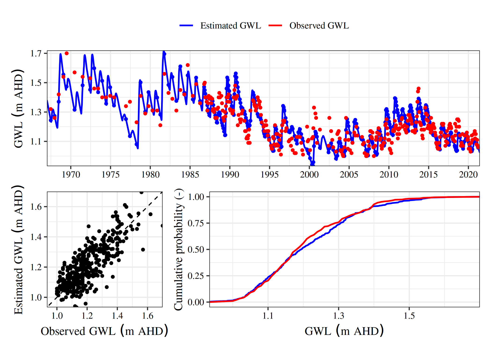
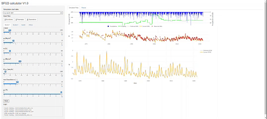

<!-- README.md is generated from README.Rmd. Please edit that file -->

# SGDr

<!-- badges: start -->

[](https://lifecycle.r-lib.org/articles/stages.html#experimental)
<!-- badges: end -->

Submarine fresh groundwater discharge (SFGD) is a critical pathway for
nutrient transport to marine ecosystems, yet its quantification is often
hindered by sparse and infrequent data in coastal zones. `SGDr` presents
a parsimonious methodology for estimating SFGD in data-sparse settings
by integrating simple modelling techniques to characterize coastal
aquifer water fluxes. It combines a soil water balance model with a
lumped-parameter representation of the aquifer, incorporating the
freshwater-seawater interface. Its simplicity enables rapid calibration
and uncertainty analysis, supporting land-use decisions and field
investigations.

## Installation

You can install the development version of SGDr from
[GitHub](https://github.com/) with:

``` r
# install.packages("devtools")
devtools::install_github("hxfan1227/SGDr")
```

## Example

To calculate the SFGD using `estimate_sgd()`, the input data required
includes:

- Daily precipitation (R \[mm\])
- Evapotranspiration (E0 \[mm\])
- Pumping rate (q1 \[m3/d\])
- Initial groundwater table (hf \[mm\])
- Initial water table in the two soil *buckets*. (phi1, phi2 \[mm\])

Below is an example of the input file:

``` r
library(SGDr)
test_data <- read.csv(SGDr_example('test_data.csv'))
head(test_data)
#>   t R  E0 phi1 phi2  hf       q1
#> 1 1 0 4.2   25  100 1.5 205.3388
#> 2 2 0 4.7    0    0 0.0 205.3388
#> 3 3 0 5.2    0    0 0.0 205.3388
#> 4 4 0 6.0    0    0 0.0 205.3388
#> 5 5 0 7.9    0    0 0.0 205.3388
#> 6 6 0 5.0    0    0 0.0 205.3388
```

The parameters are stored using
[JSON](https://www.json.org/json-en.html) format (`.json`). Two types of
parameter JSON files are required:

- Calibratable Parameters JSON File: Contains parameters that are
  adjustable or subject to calibration during model optimization.
- Constant Parameters JSON File: Contains fixed parameters that remain
  unchanged throughout the model run.

Use `json_to_parameter_list` to convert JSON files into list:

``` r

cali_pars <- json_to_parameter_list(SGDr_example('preferred.json'))
cnst_pars <- json_to_parameter_list(SGDr_example('consts.json'))
```

The SFGD can then be calculated as:

``` r
results <- estimate_sgd(test_data, cali_pars, cnst_pars, 120, 1500)
results
#> 
#> SGD Estimation Summary
#> Warning in summary.SGD_ESTIMATION_DF(x, ...): No base date available. Please provide the base date to calculate the simulation period.
#> Simulation length:  19884 days
#> Estimated SFGD (q0):  1.16 m2/d
#> Estimated Recharge (Wnet):  0.19 mm/d
#> Estimated Runoff (Q):  0.38 mm/d
#> Median hn: 1.73 m
#> Median xn: 8539.46 m
# use summary
summary(results, base_date = '19670101')
#> 
#> SGD Estimation Summary
#> Simlation period: 1967-01-01 - 2021-06-09 
#> Estimated SFGD (q0):  1.16 m2/d
#> Estimated Recharge (Wnet):  0.19 mm/d
#> Estimated Runoff (Q):  0.38 mm/d
#> Median hn: 1.73 m
#> Median xn: 8539.46 m
# use print 
print(results, base_date = '19670101')
#> 
#> SGD Estimation Summary
#> Simlation period: 1967-01-01 - 2021-06-09 
#> Estimated SFGD (q0):  1.16 m2/d
#> Estimated Recharge (Wnet):  0.19 mm/d
#> Estimated Runoff (Q):  0.38 mm/d
#> Median hn: 1.73 m
#> Median xn: 8539.46 m
```

The estimated results can be visualized with `plot`:

``` r
# visualize the prediction results
plot(results, base_date = '19670101')
```



``` r
# visualize the input data
plot(results, base_date = '19670101', type = 'input')
```



``` r
# compare with the observed groundwater table
library(data.table)
obs_data <- data.table::fread(SGDr_example('obs_data.csv'))
plot(results, y = obs_data, base_date = '19670101', type = 'comp')
```



A GUI made in shiny is also available:


